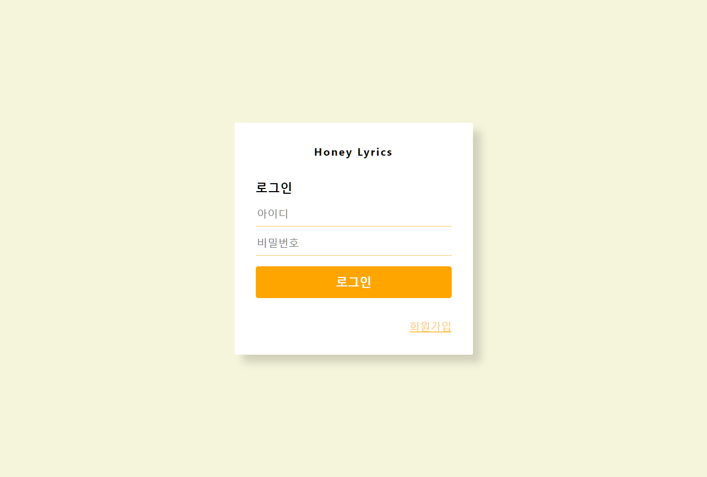

# 웹 페이지 소개

##  1. 메인 페이지 

1. **25가지**의 감정이 나누어져 있음 
2. 가사의 **감정별로 나눠져** 감정에 해당하는 노래를 선택할 수 있음
3. 노래있는 **검색엔진**으로 **변경 예정** 

## 2. 노래 종류 페이지 

1. 감정선택시 **노래들을 확인**할 수 있음  
2. **제목**,  **가수**, 앨범 과 **가사의 일부분**을 확인할 수 있음  
3. **멜론 링크**를 통해 노래를 들을 수 있음  

## 3. 노래 정보 페이지

1. **노래의 대표 감정과 세부 내용**을 확인할 수 있음
2. 노래에 관련된 **유튜브**를 확인할 수 있음
3. **가사**에 대해서 확인할 수 있음 
4. **펼쳐보기**를 통해 전체 가사를 확인할 수 있음 

### 4. 회원가입 페이

1. **회원가입** 및 **로그인** 페이지
2. 회원가입 후 개인이 좋아하는 노래와 비슷한 감정들을 확인할 수 있음\(예정\)
3. 사용자의 선호에따른 **추천 기능**\(예정\)

